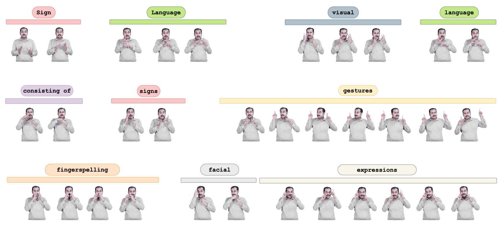

## ISLTranslate: Dataset for Translating Indian Sign Language


**Picture:** *ISLTranslate Thumbnail*

This repository contains the resources for the following paper:
> **ISLTranslate: Dataset for Translating Indian Sign Language**<br>


> **Authors:** Abhinav Joshi, Susmit Agrawal, Ashutosh Modi<br>
>
> **Abstract:** *Sign languages are the primary means of communication for a large number of people worldwide. Recently, the availability of Sign language translation datasets have facilitated the
incorporation of Sign language research in the
NLP community. Though a wide variety of
research focuses on improving translation systems for sign language, the lack of ample annotated resources hinders research in the datadriven natural language processing community.
In this resource paper, we introduce ISLTranslate, a translation dataset for continuous Indian Sign Language (ISL), consisting of 30k
ISL-English sentence pairs. To the best of our
knowledge, it is the first and largest translation
dataset for continuous Indian Sign Language
with corresponding English transcripts. We
provide a detailed analysis of the dataset and
examine the distribution of words and phrases
covered in the proposed dataset. To validate
the performance of existing end-to-end Sign
language to spoken language translation systems, we benchmark the created dataset with
multiple existing state-of-the-art systems for
sign languages.*


## Download Dataset

The ISLTranslate dataset can be downloaded using the following [🔗 Download Link](https://1drv.ms/f/s!AuBOJ2hW9GimgblntP72D_agQdokdQ?e=ZbeA6y). The dataset directory structure is as follows:

    .
    ├── data
        ├── ISLTranslate.csv                 # ISL video uid with respective ENGLISH translations

    ├── Data
        ├── ISL-videos.tar.gz                # ISL sentence/phrase videos
    ├── Extracted-Features
        ├── mediapipe_holistic_poses1.tar.gz
        ├── mediapipe_holistic_poses2.tar.gz
        .
        .
        ├── mediapipe_holistic_poses12.tar.gz
        ├── mediapipe_holistic_poses13.tar.gz
    ├── Sample-Data
        ├── dataset_sample
            ├── translation                  # Translation (sample videos)
    

## ISL-Signer Validation
To verify the reliability of the video-sentence/phrase ISL-English pairs present in the
dataset, we took the help of a certified ISL signer. Due to the limited availability of certified ISL signers, we could only use a small randomly selected sign-text pairs sample (291 pairs) for human translation and validation.
The comparison set can be found in the [ISL-Signer Validation](./data/ISL-signer_validation.csv) file.
The comparison set contains the following columns:

| uid    | Transcribed Text (text present in ISLTranslate translation dataset)     | Gold Translation (text generated by ISL Singer)
| :-----       | :---              | :-----   
1782bea75c7d-10 | "Birbal started smiling. When it was his turn, he went near the line." |Birbal started smiling. He turned towards the drawn line.
1782bea75c7d-11 | Discuss with your partner what Birbal would do. | Discuss with your partner what Birbal would do.
1782bea75c7d-12 | Now read further. | Now read further.
1782bea75c7d-13 | Birbal drew a longer line. | "Under the drawn line, Birbal"
1782bea75c7d-14|under the first one.| drew a longer line.
... | ... | ...
... | ... | ...
... | ... | ...
ee235596b76f-7|Oh you are hurting me! Said the pencil|The pencil said no you are hurting me.
ee235596b76f-8|Let me draw you one last picture and then you can do what you like.|Let me draw you one last picture and then you can do what you like.
ee235596b76f-9|very well said the mouse|very well said the mouse

### **Comparison Scores:** 
Translations are compared using standard NLP metrics such as **BLEU**, **METEOR**, **ROUGE**, and **WER**. The comparison scores are as follows:

    Number of sentences: 291 291
    BLEU-1:  0.6065795403334836
    BLEU-2:  0.5507175048668254
    BLEU-3:  0.514321619282337
    BLEU-4:  0.48933443903422547
    METEOR:  0.5733929657094051
    ROUGE:  {'rouge1': 0.6146125544989498, 'rouge2': 0.474413272825395, 'rougeL': 0.6034237198632457, 'rougeLsum': 0.6025781528163006}
    WER:  0.6188459502382213


## License
[](https://creativecommons.org/licenses/by-nc/4.0/)
The CISLR dataset follows [CC-BY-NC](CC-BY-NC) license. Thus, users can share and adapt our dataset if they give credit to us and do not use our dataset for any commercial purposes.

## Citation
```
@inproceedings{joshi-etal-2023-isltranslate,
    title = "{ISLT}ranslate: Dataset for Translating {I}ndian {S}ign {L}anguage",
    author = "Joshi, Abhinav  and
      Agrawal, Susmit  and
      Modi, Ashutosh",
    booktitle = "Findings of the Association for Computational Linguistics: ACL 2023",
    month = jul,
    year = "2023",
    address = "Toronto, Canada",
    publisher = "Association for Computational Linguistics",
    url = "https://aclanthology.org/2023.findings-acl.665",
    pages = "10466--10475",
    abstract = "Sign languages are the primary means of communication for many hard-of-hearing people worldwide. Recently, to bridge the communication gap between the hard-of-hearing community and the rest of the population, several sign language translation datasets have been proposed to enable the development of statistical sign language translation systems. However, there is a dearth of sign language resources for the Indian sign language. This resource paper introduces ISLTranslate, a translation dataset for continuous Indian Sign Language (ISL) consisting of 31k ISL-English sentence/phrase pairs. To the best of our knowledge, it is the largest translation dataset for continuous Indian Sign Language. We provide a detailed analysis of the dataset. To validate the performance of existing end-to-end Sign language to spoken language translation systems, we benchmark the created dataset with a transformer-based model for ISL translation.",
}
```
